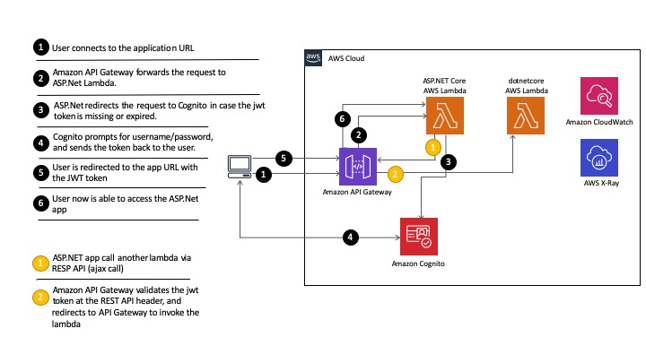

## Build and monitor a secure Serverless app powered by AspNetCore WebApp with Amazon Cognito and AWS X-Ray

In this workshop, you'll deploy a serverless web application based on AspNetCore that leverages the Amazon Cognito Hosted UI for sign-up and sign-in. During the sign-in process, the AspNetCore application receives an identity token from Amazon Cognito, which is processed by the standard DotNetCore OpenIdConnect library. The AspNetCore WebApp will interface with a serverless DotNet backend via a RESTful web service call. The erverless DotNet backend is exposed via Amazon API Gateway. Its authentication expects the same identity token of the signed-in user who logged into the AspNetCore WebApp, hence providing authentication enforcement and seamless integration with Amazon Cognito.

See the diagram below for a depiction of the complete architecture.

## Initial environment setup

### Prerequisites

#### Laptop Machine

A laptop with Wi-Fi running Microsoft Windows or Mac OS X with the following software installed:

- Visual Studio Code (its installation is covered during Lab 0)
- An Internet browser such as Chrome, Firefox, Safari, or Edge.
- Ability to SSH with port forwarding (ssh or Putty)

#### AWS Account

- Ability to create AWS resources including EC2, Amazon Cognito, AWS Lambda, Amazon Api Gateway, Amazon S3 and IAM Roles.
- Amazon EC2 key pair created in the AWS region you are working on. Learn how to [create a key pair](https://docs.aws.amazon.com/AWSEC2/latest/UserGuide/ec2-key-pairs.html)

:warning: **Important Note: This guide creates chargeable AWS resources.** You may wish to remove these resources upon completion of the guide to avoid incurring future charges to your account. To do this, be sure to follow the instructions in *Clean up* module.

## Labs

Follow the modules to configure and deploy the  AspNetCore application to AWS successfully.

| Labs |
| ------------- |
| [0 - Setting up AWS Tools and credentials](lab-0-tools-and-cred/) |
| [1 - Creating the AspNetCore](lab-1-aspnetcore/) |
| [2 - Adding OpenId to AspNetCore WebApp](lab-2-openid/) |
| [3 - Creating the backend serverless dotnet app](lab-3-backend/) |
| [4 - Putting it all together](lab-4-alltogether/) |
| [5 - (Optional) Improving monitoring with AWS X-Ray](lab-5-xray/) |
| [99- Clean up](lab-99-clean-up/) |