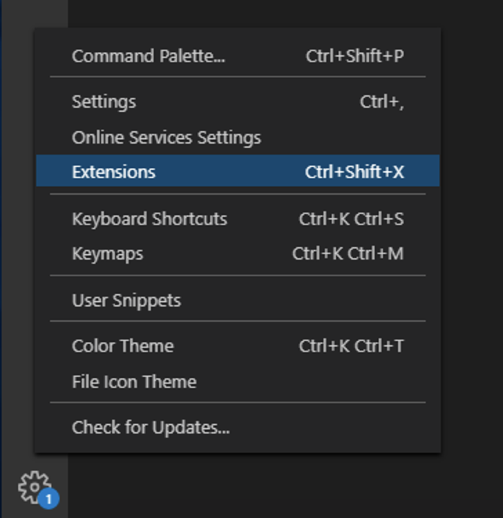
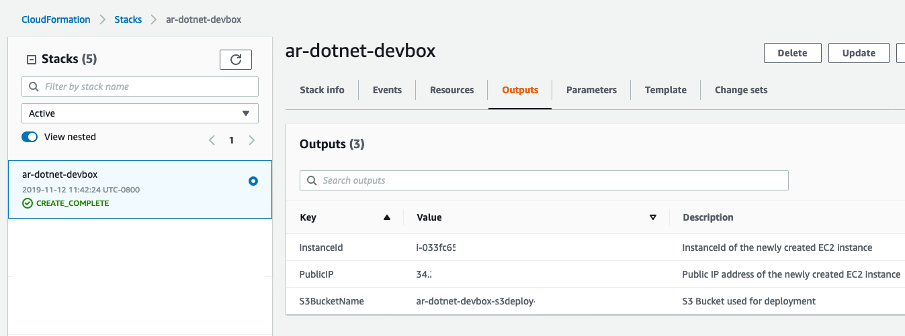
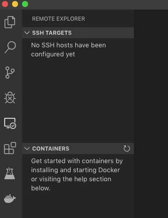
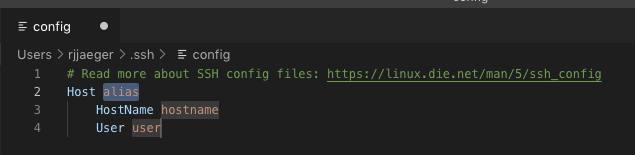
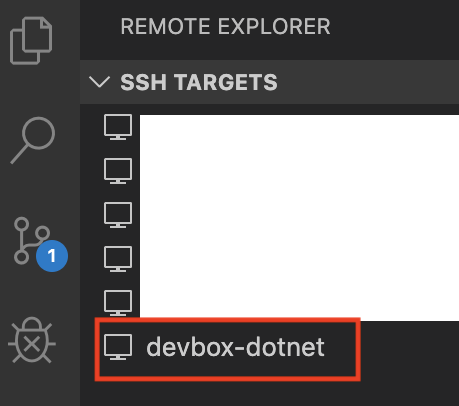
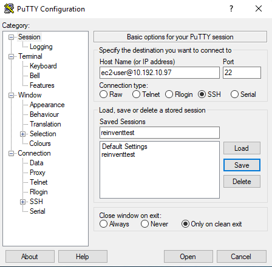
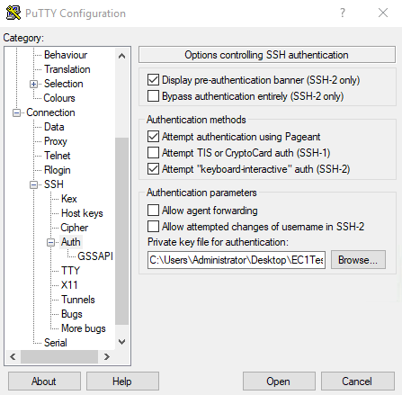
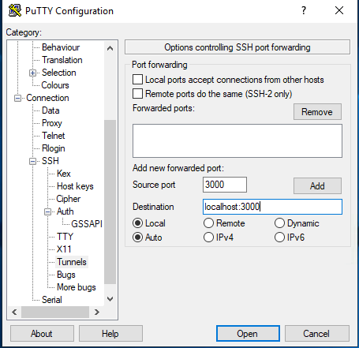

# Lab 0: Setting up this workshop tools and credentials

The steps in this module will walk you through setting up the [Visual Code](https://code.visualstudio.com/) with the AWS extensions. You will also create an [Identity and Access Management (IAM)](https://aws.amazon.com/iam/) user in your account with programmatic credentials, and configure a local credential profile containing the AWS access and secret keys generated for the user that will then be used by the AWS tools.

## Step 1: Deploy the Dev Environment
In this step, we will create a Linux Machine for executing the lab steps. The Linux will have installed:
- The AWSCLI 
- The AWS [SAM CLI](https://github.com/awslabs/aws-sam-cli)
- The Long Term Support (LTS) [.NET Core](https://dotnet.microsoft.com/platform/support/policy/dotnet-core) version supported by [AWS Lambda for .NET Core](https://github.com/aws/aws-lambda-dotnet) at the time this Lab was conceived v2.1.8.
 - :notebook: **Note:** It is possible to execute non-LTS .NET Core on AWS, as per this [blog](https://aws.amazon.com/blogs/developer/announcing-amazon-lambda-runtimesupport/). For simplicity, this workshop is based on the LTS .NET Core version.

---

1. Download the **[devbox.yml](../cfn-templates/devbox.yml)** located at *serverless-aspnet-donet-cognito/cfn-templates*
2. Log into the [CloudFormation Management Console](https://console.aws.amazon.com/cloudformation/home).
3. Select **Create stack** with the *With new resources* option.
4. Click *Upload a template file*, and then **Choose file** and select the **devbox.yml**
5. Click *Next*.

:notebook: **Note**: For this workshop use something like *<first initial> + <last initial> + -dotnetcore-devbox*. For John Smith: js-dotnetcore-devbox

6. Give the **Stack name** a name based on the suggestion above. Select a key-pair and leave all the other fields with the default values. If you don't have any Ec2 key-pair available [Create-your-key-pair](https://docs.aws.amazon.com/AWSEC2/latest/UserGuide/ec2-key-pairs.html#having-ec2-create-your-key-pair), and repeat this step.
7. Click Next twice. Don't forget to check the checkbox for **I acknowledge that AWS CloudFormation might create IAM resources.** as the cloudformation creates a role for the EC2 instance.

:notebook: **Note**: While the stack is deploying, which takes approximately 5 minutes to finish, we carry on to the next step.

## Step 2: Installing Visual Studio Code and configuring its extensions

In this step, you will install the Visual Studio Code, along with useful extensions. Visual Studio Code is compatible with Windows, Mac, and Linux.

1. Install Visual Studio Code - https://code.visualstudio.com/
2. Start Visual Studio and, at the lower-left corner, click on the *Manage* icon, then *Extensions*.
 


3. In the Search Extensions field type the following packages names and click on *install*. More information about how to manage Visual Studio Code Extensions [here](https://code.visualstudio.com/docs/editor/extension-gallery)
 ```
 ms-vscode-remote.remote-ssh
 ms-vscode.csharp
 ```

4. Click on the *Manage* icon again and check for Updates or install a pending Update. Restart VSCode if needed.

### Setting the Remove Developer Extension

1. Log into the [CloudFormation Management Console](https://console.aws.amazon.com/cloudformation/home).
2. Check the status of the CloudFormation stack you have created at step1. Wait until its Status is complete.
3. Go to the Outputs tab, and make a note of the **S3BucketName** and **PublicIP**, as you will need this information for the next steps.
 


1. Login to the development box. Specify the appropriate private key and ``PublicIP`` from the EC2 instance. See below for three different ways to connect.

#### Visual Studio Code (Mac or Windows) - The recommended way for this workshop

1. Open Visual Studio Code. If the Remove Developer Extension is not installed, go back to **Step 1** to see the installation instructions.

2. Navigate to the Remote Explorer extension.



1. Click the gear icon next to the SSH Targets to create a configuration file. It will generate a new file with default values.



4. Replace the entry with values from the template below. Replace the **Host**, **HostName**, and **IdentityFile** with values from your environment and deployment. After saving the config, an SSH Target will appear. If not, close and reopen Visual Studio Code.

#### Mac
```
Host devbox-dotnet
 HostName <Ip address from cloudformation output>
 IdentityFile "~/path/to/EC2PrivateKey.pem"
 User ec2-user
 LocalForward localhost:3000 localhost:3000
```
#### Windows
```
Host devbox-dotnet
 HostName <Ip address from cloudformation output>
 IdentityFile "C:\Users\Administrator\path\to\EC2PrivateKey.pem"
 User ec2-user
 LocalForward localhost:3000 localhost:3000
```



1. Click the **Connect to Host in New Window** icon next to the listed SSH Target. After connecting, select **New Terminal** from the **Terminal** menu in Visual Studio Code. This will open a terminal session in the bottom panel of the window. You are now connected to your developer EC2 instance!

<!--

-->

#### Other options to connect to the dotnetcore-devbox
These options are available for you to connect directly to the Amazon EC2 instance to execute the commands from this workshop. This method required editing the files directly on the Amazon EC2 instance using **vi** or **nano**, which is not covered in this workshop.

<details>
<summary><strong> Mac (SSH)(expand for details)</strong></summary><p>
```
ssh -i path/to/EC2PrivateKey ec2-user@PublicIp -L localhost:3000:localhost:3000
```

</p></details>

<details>
<summary><strong> Windows (Putty)(expand for details)</strong></summary><p>

1. Convert your EC2 Private Key. Follow the steps [here](https://docs.aws.amazon.com/AWSEC2/latest/UserGuide/putty.html) if necessary.

2. Specify the ``ec2-user@PublicIP`` in the Host Name field.



1. Specify the converted .ppk file in the SSH/Auth ``Private key file for authentication`` field.



1. Configure tunneling for localhost:3000 in the SSH/Tunnels. Specify the ``Source port`` and ``Destination`` and click **Add**.



</p></details>

***You have now completed this lab and can move onto [Lab 1](../lab-1-aspnetcore/).***
