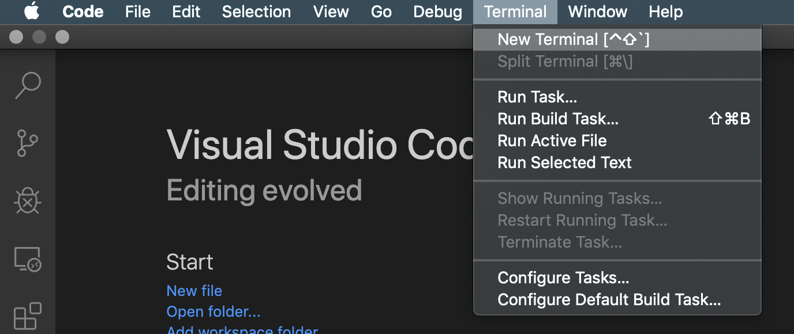

# Lab 1: Creating the AspNetCore application

The steps in this Lab will create a new AWS lambda AspNetCore to act as your main website. We will also install all the required nuget packages and add/change the code for the workshop.

## Step 1: using dotnet cli to create a new project

1. Go to **Terminal** menu and select **New Terminal**
 


1. Configure the AWS region in your terminal by executing ```aws configure```. Provide information solely to the **Default region name**. In the example below, the *Default region name* was set to Oregon (us-west-2).
 ```
 [ec2-user@ip-172-17-2-121 WebApp]$ aws configure
 AWS Access Key ID [None]: 
 AWS Secret Access Key [None]: 
 Default region name [None]: us-west-2
 Default output format [None]: 
 ```
2. Install the AWS extensions for the dotnet CLI.
 ```bash
 dotnet tool install -g Amazon.Lambda.Tools
 ```
3. Install the Amazon.Lambda.Templates blueprints by executing the following command :
 ```bash
 dotnet new -i "Amazon.Lambda.Templates::*"
 ```
4. To see a list of the Lambda templates execute ```dotnet new lambda --list```
5. Create the *WebApp* project running the following command.

:warning: **The project name has to be named WebApp (capital W and capital A) as all the workshop modules are based on this name**.

 ```bash
 dotnet new serverless.AspNetCoreWebApp --name WebApp
 ```
 
6. You now have a directory called WebApp with a C# project template for AspNetCore application.

7. Go to File -> *Open* and select **/home/ec2-user/WebApp/src/WebApp/**. It will load all the sub-directories and files for you.


### Step 2: Publishing the serverless.AspNetCoreWebApp to AWS
Using the dotnet cli we will deploy our AspNet Core WebApp to AWS.

1. Edit the **serverless.template** file. We are going to add Add the lines ```"Tracing": "Active"``` and the Policies: ```"Policies": [ "AWSLambdaFullAccess", "AmazonSSMFullAccess" ],```. Replace the **serverless.template** content with the content below. Don't forget to save the file before moving to the next step.

```json
{
  "AWSTemplateFormatVersion": "2010-09-09",
  "Transform": "AWS::Serverless-2016-10-31",
  "Description": "An AWS Serverless Application that uses the ASP.NET Core framework running in Amazon Lambda.",
  "Parameters": {},
  "Conditions": {},
  "Resources": {
    "AspNetCoreFunction": {
      "Type": "AWS::Serverless::Function",
      "Properties": {
        "Handler": "WebApp::WebApp.LambdaEntryPoint::FunctionHandlerAsync",
        "Runtime": "dotnetcore3.1",
        "CodeUri": "",
        "MemorySize": 512,
        "Timeout": 30,
        "Role": null,
        "Policies": [ "AWSLambdaFullAccess", "AmazonSSMFullAccess" ],
        "Tracing": "Active",
        "Environment": {
          "Variables": {}
        },
        "Events": {
          "ProxyResource": {
            "Type": "Api",
            "Properties": {
              "Path": "/{proxy+}",
              "Method": "ANY"
            }
          },
          "RootResource": {
            "Type": "Api",
            "Properties": {
              "Path": "/",
              "Method": "ANY"
            }
          }
        }
      }
    }
  },
  "Outputs": {
    "ApiURL": {
      "Description": "API endpoint URL for Prod environment",
      "Value": {
        "Fn::Sub": "https://${ServerlessRestApi}.execute-api.${AWS::Region}.amazonaws.com/Prod/"
      }
    }
  }
}
```

2. Execute the following command:
 
:notebook: **Reminder**: To see all the resources created : ```aws cloudformation describe-stack-resources --stack-name DotNetLab --query 'StackResources[*].{Type:ResourceType,Id:PhysicalResourceId}' --output text``` to see all the resources created. The [Support Commands Page](/SupportCommands.md) provides a list of useful commands that help you identify the names of the resources created in the labs.

 ```bash
 dotnet lambda deploy-serverless --template serverless.template --s3-bucket <bucket name> --s3-prefix "aspnetcorewebapp/" --stack-name AspNetCoreWebApp
 ```

1. When the deployment finishes, you will be able to see all the resources that were created and the URL of your AspNetCore webapplication. Something like:
   
 ```
 Stack finished updating with status: CREATE_COMPLETE

 Output Name Value
 ------------------------------ --------------------------------------------------
 ApiURL https://<restApiId>.execute-api.<awsRegion>.amazonaws.com/Prod/
 ```
4. Copy and past the URL into a browser to make sure that your AspNet Core is working.
 

5. Let's check the cloudformation stack resources that were created for the AspNetCoreWebApp. The dotnet lambda blueprint took care of creating an Amazon API Gateway, IAM Roles and its policies and the Lambda itself. The following command shows the resource types and their Ids. 
   
```bash
aws cloudformation describe-stack-resources --stack-name AspNetCoreWebApp --query 'StackResources[*].{Type:ResourceType,Id:PhysicalResourceId}' --output text
```

### Step 3: Installing the Nuget packages
Now it is time to prepare our application to integrate with the AWS resources we want by adding the AWS libraries to our project.

1. From the Visual Code terminal you will install the nuget packages, like at the screenshot below:

 

:notebook: **Note:** *You can copy and paste all the lines below into the terminal prompt. The last line pasted still need to you press ENTER to install it*.

```bash
dotnet add package Newtonsoft.Json --version 12.0.3
dotnet add package AWSSDK.Core --version 3.3.107.9
dotnet add package AWSSDK.Lambda --version 3.3.109.39
dotnet add package Amazon.Lambda.Core --version 1.1.0
dotnet add package AWSSDK.Extensions.NETCore.Setup --version 3.3.101
dotnet add package AWS.Logger.Core --version 1.6.0
dotnet add package AWSSDK.S3 --version 3.3.111.10
dotnet add package AWSSDK.SimpleSystemsManagement --version 3.3.125.2
dotnet add package Amazon.Lambda.APIGatewayEvents --version 2.1.0
dotnet add package AWSSDK.CognitoIdentityProvider --version 3.3.109.49
dotnet add package Amazon.AspNetCore.DataProtection.SSM --version 1.1.0
dotnet add package Microsoft.AspNetCore.Authentication.OpenIdConnect --version 3.1.5
dotnet add package Microsoft.AspNetCore.Authentication.Cookies --version 2.2.0
```

:warning: if you copy and past the code above into the terminal you may have to hit **ENTER** one more time to install the last line.


1. You can verify if all the packages were installed by looking at the WebApp.csproj
 ```bash
 cat WebApp.csproj
 ```
3. At the terminal windows, let's confirm that our code compiles with no errors
 ```bash
 dotnet publish -c Release
 ```

***You have now completed this lab and can move onto [Lab 2](../lab-2-openid/).***
