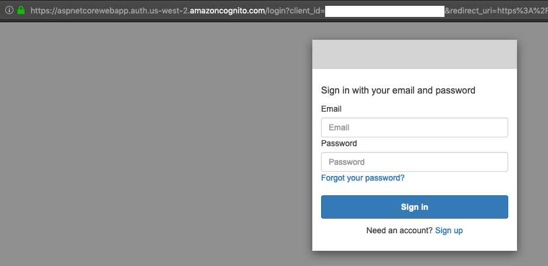

# Lab 2: Adding OpenId to AspNetCore
In this Lab, the AWS Lambda AspNetCoreWebApp is going to be integrated with Amazon Cognito by using OpenID.

### Step 1: Creating a User Pool
This step will create an Amazon Cognito user pool. A user pool is a user directory in Amazon Cognito. With a user pool, your users can sign in to your web or mobile app through Amazon Cognito.

1. Using the Visual Code terminal, executing the following cli command to create an Amazon Cognito user pool. 
```bash
aws cognito-idp create-user-pool --pool-name DotNetCognitoUserPool --auto-verified-attributes email --username-attributes email --mfa-configuration OFF --schema '[{"Name":"given_name","Required":true},{"Name":"family_name","Required":true},{"Name":"email","Required":true}]'
```
:exclamation: Don't forget to take a note of the **PoolId** and **Pool ARN**. You will need these information to set up the OpenId library. The PoolID and Pool Arn can be copied from the command output. They appear at the **Id** and **Arn** fields, as the example below:

```json
"CreationDate": 1583628374.102, 
"EstimatedNumberOfUsers": 0, 
"Id": "us-west-2_abcdef123", 
"Arn": "arn:aws:cognito-idp:us-west-2:000000000000:userpool/us-west-2_abcdef123",
"LambdaConfig": {}
```

:notebook: **Note** In this workshop, we won't create an Identity Pool. With an identity pool, your users from the user pool can obtain temporary AWS credentials to access AWS services, such as Amazon S3 and DynamoDB.

2. An app is an entity within a user pool that has permission to call unauthenticated APIs (APIs that do not have an authenticated user), such as APIs to register, sign in, and handle forgotten passwords. To call these APIs, you need an app client ID and an optional client secret. The aws cli command below creates an user pool client. Make sure to replace the **PoolId**, the URL prefix created for your AspNetWebApp lambda on the previous lab, and the **AWS Region** in the command.
   
:notebook: **Note** You can find **restApiId** by running ```aws apigateway get-rest-apis --query 'items[*].{name:name,restApiId:id}'```. The output will shows all the restApiId. Copy the one that contains **AspNetCoreWebApp**

```json
[
    {
        "restApiId": "aws43ro5672", 
        "name": "ApiTest"
    }, 
    {
        "restApiId": "aws57ro2934", 
        "name": "AspNetCoreWebApp"
    }
]
```

:warning: **Attention** The command below requires you to replace **poolId**, **awsRegion** and **restApiId**
   
```bash
aws cognito-idp create-user-pool-client --user-pool-id <poolId> --client-name WebApp --generate-secret --refresh-token-validity 30 --allowed-o-auth-scopes openid email profile --supported-identity-providers COGNITO --allowed-o-auth-flows-user-pool-client --allowed-o-auth-flows code --callback-urls '["https://<restApiId>.execute-api.<awsRegion>.amazonaws.com/Prod/signin-oidc"]' --logout-urls '["https://<restApiId>.execute-api.<awsRegion>.amazonaws.com/Prod/"]'
```

3. The command output from the command above provides the Cognitp **ClientId** and **ClientSecret**. These keys will be used shortly in this lab. Please, keep a note of them. The output looks like the json below: 
   
```json
{
 "UserPoolClient": {
 "ClientSecret": "1kd3eqiif72cjkjkse54554555raerefefd", 
 "CallbackURLs": [
 "https://<restApiId>.execute-api.<awsRegion>.amazonaws.com/Prod/signin-oidc"
 ], 
 "AllowedOAuthScopes": [
 "openid", 
 "profile", 
 "email"
 ], 
 "UserPoolId": "us-west-2_abcdef123", 
 "AllowedOAuthFlowsUserPoolClient": false, 
 "LastModifiedDate": 1583685892.599, 
 "ClientId": "5o442jj89nkauhjknu3bk", 
 "AllowedOAuthFlows": [
 "code"
 ], 
 "LogoutURLs": [
 "https://<restApiId>.execute-api.<awsRegion>.amazonaws.com/Prod/"
 ], 
 "SupportedIdentityProviders": [
 "COGNITO"
 ], 
 "RefreshTokenValidity": 30, 
 "CreationDate": 1583685892.599, 
 "ClientName": "WebApp"
 }
}
```

4. After setting up an app client, you can configure the address of your sign-up and sign-in webpages. You can use an Amazon Cognito hosted domain and choose an available domain prefix. For this workshop, use *first initial* + *last initial* + *-dotnetcore-cognito*. For John Smith: js-dotnetcore-cognito. If you receive an error saying **Domain already exists** try a different domain name.
   
```bash
aws cognito-idp create-user-pool-domain --user-pool-id <poolId> --domain <first initial> + <last initial> + -dotnetcore
```

### Step 2: Setting up Amazon Api Gateway Authorizer

1. Open the file **Startup.cs** on Visual Studio Code, by clicking on the filename at the left-panel.
2. Replace its entire content with [Startup.cs](Startup.cs). If you have cloned this repo, the file is located under lab-2-openid.

:notebook: **Note** The Startup.cs script initializes the [OpenIdConnectOptions](https://docs.microsoft.com/en-us/dotnet/api/microsoft.aspnetcore.builder.openidconnectoptions) by using the Amazon Cognito information defined at **appsettings.json**. It also instructs the [DataProtection](https://docs.microsoft.com/en-us/aspnet/core/security/data-protection/introduction) to utilize AWS [SSM Provider](https://github.com/aws/aws-ssm-data-protection-provider-for-aspnet) for the encryptions keys management and rotation. The [AddRazorPagesOptions](https://docs.microsoft.com/en-us/aspnet/core/security/authorization/razor-pages-authorization) defines what pages require Authentication. And, lastly, we configure the [LambdaLoggerOptions](https://github.com/aws/aws-lambda-dotnet/blob/master/Libraries/src/Amazon.Lambda.Logging.AspNetCore/LambdaLoggerOptions.cs) for better integration/experience with AWS CloudlogWatch.

3. Replace the **appsetting.json** with the following:

:warning: Don't forget replace the **Client Id**, **Client Secret**, **domain**, **restApiId** and **awsRegion** with the proper values.

 ```json
{
  "AWS": {
    "Cognito": {
      "PoolId": "<poolId>",
      "SignedOutRedirectUri": "https://<domain>.auth.<awsRegion>.amazoncognito.com/logout?client_id=<poolId>&response_type=code&logout_uri=https://<restApiId>.execute-api.<awsRegion>.amazonaws.com/Prod/"
    },
    "OpenId": {
      "ClientId": "<clientId>",
      "ClientSecret": "<secretId>",
      "IncludeErrorDetails": true,
      "MetadataAddress": "https://cognito-idp.<awsRegion>.amazonaws.com/<poolId>/.well-known/openid-configuration",
      "RequireHttpsMetadata": false,
      "ResponseType": "code",
      "SaveTokens": true,
      "TokenValidationParameters": {
        "ValidateIssuer": true
      }
    }
  },
  "Logging": {
    "IncludeScopes": false,
    "LogLevel": {
      "Default": "Warning"
    }
  }
}
 ```

4. Make sure you project still compiles correctly.
 ```bash
 dotnet publish -c Release
 ```

5. Re-publish the project by executing the following command:

:notebook: **Note**: The [Support Commands Page](/SupportCommands.md) provides a list of useful commands that helps you identify the resources' names created in the labs; like the Amazon S3 bucked required for deployment.

 ```bash
 dotnet lambda deploy-serverless --template serverless.template --s3-bucket <bucket name> --s3-prefix "aspnetcorewebapp/" --stack-name AspNetCoreWebApp
 ```
 
6. Wait until the result ```Stack finished updating with status: UPDATE_COMPLETE```. Copy the ApiURL to a browser. This time the application will ask for a Jwt Token; hence will redirect you to the Amazon Cognito hosted UI for authentication.



7. Click on **Sign up** at the login prompt.
8. Fill up the **Sign up with a new account** fields accordingly (using a valid email address) and create the user by clicking on **Sign up** button.
9. Check your email inbox for a message from *no-reply@verificationemail.com*, which contains your verification code. Type it in the verification code prompt and **Confirm Account**.
10. You should now be able to access the AspNetCore WebApp.

:notebook: **Note:** for more information about ASP.NET Core web applications using ASP.NET Core Identity with Amazon Cognito access [here](https://github.com/aws/aws-aspnet-cognito-identity-provider).

***You have now completed this lab and can move onto [Lab 3](../lab-3-backend/).***
