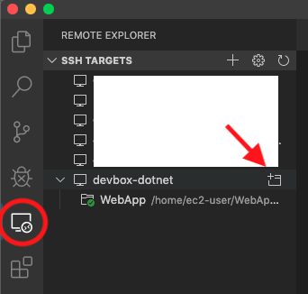
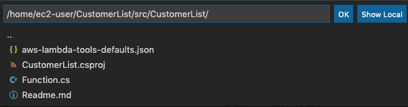
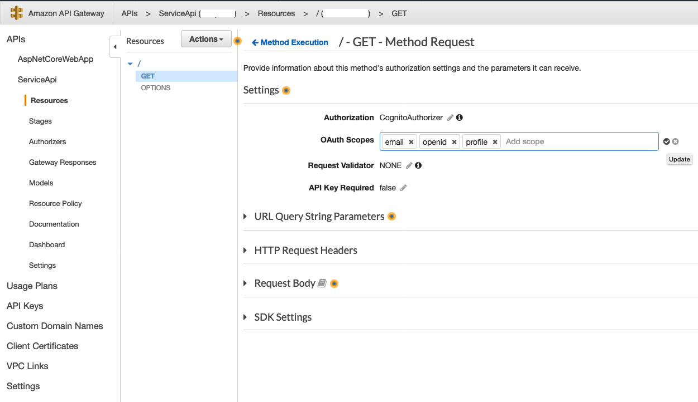
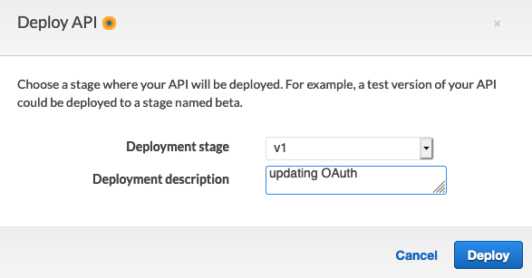
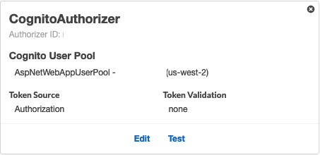

# Lab 3: Adding a serverless dotnet backend

The steps in this Lab will create a new AWS Lambda to act as one of many microservices that supports your web application. This microservices will be exposed via a new Amazon API Gateway that will be integrated with Amazon Cognito. During the REST API call, the web application will provide the JWT token to authenticate into the backend microservices.

## Step 1: using dotnet cli to create a new project

1. Open a new remote host Visual Studio Code by clicking on the (+) icon on the left side of the devbox-donet.
 


2. Go to **Terminal** menu and select **New Terminal**. In the terminal, execute the command below:

:warning: **The project name has to be named CustomerList (capital C and capital L) as all the workshop modules are based on this name**.

 ```
 dotnet new lambda.EmptyFunction --name CustomerList
 ```
 
3. You now have a directory called **CustomerList** with a C# project template for a NetCore application.

4. Go to File -> *Open* and select the **/home/ec2-user/CustomerList/src/CustomerList** folder. It will load all the sub-directories and files for you.



:exclamation: We will run all the commands using this terminal window. Keep it opened.

### Step 2: Publishing the serverless.AspNetCoreWebApp to AWS
We will create an AWS Serverless Application Model [SAM](https://github.com/awslabs/serverless-application-model) template to instruct the dotnet cli to provision our microservices.

1. From the Visual Code terminal windows execute the following commands:

:notebook: **Note:** *You can copy and paste all the lines below into the terminal prompt. The last line pasted still need a ENTER to be installed*.

 ```
 dotnet add package Newtonsoft.Json --version 12.0.2
 dotnet add package AWSSDK.Core --version 3.3.103.48
 dotnet add package AWSSDK.Lambda --version 3.3.103.16
 dotnet add package Amazon.Lambda.Core --version 1.1.0
 dotnet add package AWSSDK.Extensions.NETCore.Setup --version 3.3.100.1
 dotnet add package AWSSDK.S3 --version 3.3.104.36
 dotnet add package AWSSDK.CognitoIdentityProvider --version 3.3.103.3
 dotnet add package AWS.Logger.Core --version 1.4.0
 dotnet add package Amazon.Lambda.APIGatewayEvents --version 1.2.0
 dotnet add package RestSharp --version 106.6.10

 ```
1. Replace the entire **Function.cs** code with the following [Function.cs](Function.cs). This file is available in this repo at the lab-3-backend.
 
 :notebook: **Note:** This is a simple code that only makes a RestApi call to a [on-line tool](https://uinames.com/) to generate fake names. It defines the POCO classes to map API call results. The lambda function replies back to Amazon ApiGateway using a json structure based on the [APIGatewayProxyResponse](https://github.com/aws/aws-lambda-dotnet/blob/master/Libraries/src/Amazon.Lambda.APIGatewayEvents/APIGatewayProxyResponse.cs), which is the required format for Lambda Proxy Integration. More information at [Set up Lambda Proxy Integration in API Gateway](https://docs.aws.amazon.com/apigateway/latest/developerguide/set-up-lambda-proxy-integrations.html)

2. At the left panel of the **Visual Studio Code** right-click on the **CustomerList** directory and select New File, name it [cfn-sam-deployment.yaml](cfn-sam-deployment.yaml). Its content can be downloaded by clicking on cfn-sam-deployment.yaml. The file is available in this repo at the lab-3-backend.

 :notebook: **Note:** the cfn-sam-deployment.yaml is a [SAM](https://github.com/awslabs/serverless-application-model) cloudformation file, that creates the Amazon API Gateway and its integration with an existent Amazon Cognito. It also creates and deploys the lambda function with all permissions and integrations required for the function to work.

3. Compile the new code to create the binaries that will be deployed.
 ```
 dotnet publish -c Release
 ```

4. Execute the following command to deploy the new function to AWS. **Use the same backet bucket from lab1**. Don't forget to replace the **Amazon Cognito User Pool Id** on the command, and also to add your **<first initial>**+**<last initial>**+*-CustomerList* at the stack-name parameter:
 
 :notebook: **Note**: The [Support Commands Page](/SupportCommands.md) provides a list of useful commands that help you identify the names of the resources created in the labs; like the Amazon S3 bucked required for deployment and the Amazon Cognito User Pool Id.
 ```
 dotnet lambda deploy-serverless --template cfn-sam-deployment.yaml --s3-bucket <your bucket name> --s3-prefix "customerlist/" --stack-name <first initial> + <last initial> + -CustomerList --template-parameters UserPoolId=<userPoolId>
 ```
5. When the deployment finishes tiy will the following message:
 ```
 Stack finished updating with status: CREATE_COMPLETE
 ```
6. List all the lambda functions names that you have deploy by running:
 ```
 aws lambda list-functions --query 'Functions[].FunctionName'
 ```
7. Copy the lambda function name that starts with *first initial* + *last initial* + *-CustomerList* and execute the follow aws cli command replacing the **<CustomerListName>** the Lambda CustomerList name. This command will invoke the CustomerList AWS Lambda function, saving the results into **response.json** file:
 ```
 aws lambda invoke --function-name <CustomerListName> response.json
 ```
8. You should receive the following output:
 ```
 {
 "StatusCode": 200,
 "ExecutedVersion": "$LATEST"
 }
 ```
9. Check the response sent by the lambda function by executing ```more response.json```. You will encouter a json strucutre that contains : *{"statusCode":200,"headers":{"Content-Type":"application/json","Access-Control-Allow-Origin":"\*","Access-Control-Allow-Credentials":"true"},"multiValueHeaders":null,"body": **randon information**,"isBase64Encoded": false}*

10. Let's check the cloudformation stack resources that were created for the solution. The dotnet lambda blueprint took care of creating an Amazon API Gateway, IAM Roles and its policies and the Lambda itself. The following command shows the resource types and their Ids. 
```
aws cloudformation describe-stack-resources --stack-name <first initial> + <last initial> + -CustomerList --query 'StackResources[*].{Type:ResourceType,Id:PhysicalResourceId}'
```

### Step 2: Adding OAuth Scopes to the Amazon API Gateway that exposes the CustomerList microservices

1. Open the [Amazon API Gateway](https://console.aws.amazon.com/apigateway/) console.
2. Select the *<first initial>*+*<last initial>*+*-CustomerList* Api.
3. Select the method **GET**.
4. Select **Method Request**.
5. Add **email**, **openid** and **profile** to the *OAuth Scopes* and click on update (The check mark icon at the end of the field).



6. Deploy a new version of Amazon API Gateway by going to **Actions** at the top left -> **Deploy API**.
 
7. Select **v1** for the **Deployment stage** and click on Deploy.
 


8. After successfully deploying the API, select **Authorizers**. You will notice that Amazon API Gateway is integrated with Amazon Cognito for authentication. When calling a REST API that requires authentication, you must use the **Authorization** key in the header of the call, with the JWT token provided by Amazon Cognito.



***You have now completed this Lab and can move onto [Lab 4](../lab-4-alltogether/).***
