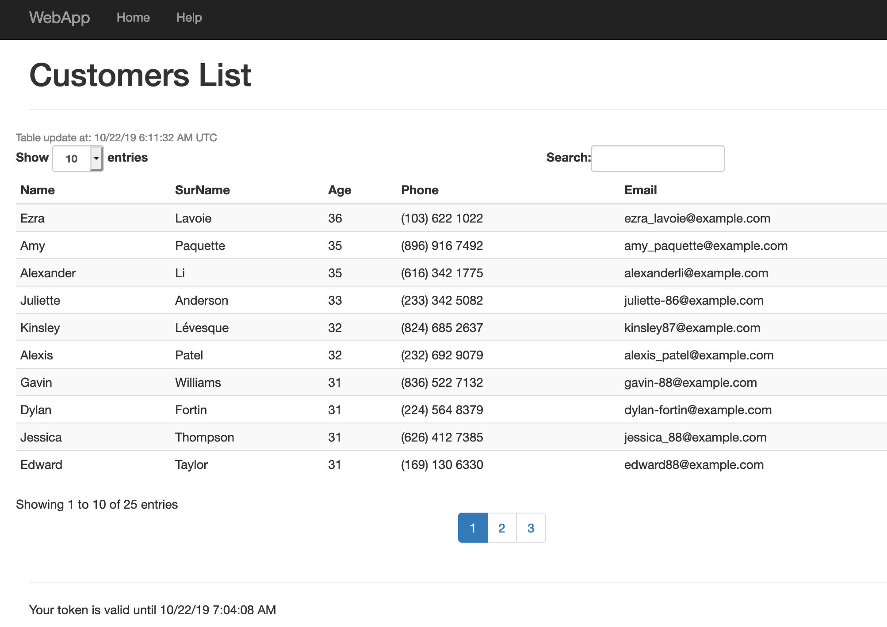

# Lab 4: Putting it all together

In this Lab, you will stitch together the ASPNetCore WebApp with the CustomerList microservices. Both lambdas integrate with Amazon Cognito, using distinct methods.

The AspNetCore WebApp integrates with Amazon Cognito via OpenId library. On the other hand, the CustomerList microservice relies on the Amazon API Gateway to enforce authentication. The CustomerList Api Gateway requires a valid identity token issued by the same Amazon Cognito that authenticated the user at the Hosted UI sign-in page.

## Step 1: Creating a new AspNetCore Razor page to reference the CustomerList microservices

1. At this point, you probably have two *Visual Studio Codes* opened; one with the WebApp project, and a second one with the CustomerList project. At any Visual Studio Code, go to *Window* and select the one that contains **WebApp** in its name.
 
2. From the Visual Studio, create two new files **Home.cshtml** and **Home.cshtml.cs** by right-clicking on the **Pages** directory and selecting **New file**.


3. Download the [Home.cshtml](Home.cshtml) file and copy its content to the newly created **Home.cshtml**. Repeat the step for the [Home.cshtml.cs](Home.cshtml.cs) file too. Both files are also accessible at the *lab-4-alltogether* directory in the repo.
 
4. Execute ```aws apigateway get-rest-apis --query 'items[*].{name:name,restApiId:id}'``` and search for the result that contains **-CustomerList** in its the name.
5. Open the **Home.cshtml**. Go to line 35 and replace the **restApiId** value (obtained on the previous step). The excerpt below shows what to look for. Don't forget to replace the **awsRegion** to the region you are running the workshop.
 ```
 "ajax": {
 "url": 'https://<restApiId>.execute-api.<awsRegion>.amazonaws.com/v1',
 "type": "GET",
 "beforeSend": setHeader,
 "error": function () {
 },
 }
 ```

6. Download the [Index.cshtml.cs](Index.cshtml.cs) and replace the existent **Index.cshtml.cs** with the content of the downloaded file.

7. Replace the existent **Index.cshtml** code with:
 ```
 @page
 @model IndexModel
 @{
 ViewData["Title"] = "Home page";
 }

 <h2>Congratulations!!! Your ASP.NET Core Web Application is now Serverless</h2>

 <p><small>
 @ViewData["Token"]
 </small></p>

 <p><small>
 @ViewData["Message"]
 </small></p>
 ```

8. Compiles the new code to create the binaries that will be deployed.
 ```
 dotnet publish -c Release
 ```
9. Execute the following command:
 
 :notebook: **Note**: The [Support Commands Page](/SupportCommands.md) provides a list of useful commands that help you identify the names of the resources created in the labs; like the Amazon S3 bucked required for deployment.

 ```
 dotnet lambda deploy-serverless --template serverless.template --s3-bucket <bucket name> --s3-prefix "aspnetcorewebapp/" --stack-name <first initial> + <last initial> + -AspNetCoreWebApp
 ```
9. Wait until the deployment finished:
 ```
 Stack finished updating with status: UPDATE_COMPLETE

 Output Name Value
 ------------------------------ --------------------------------------------------
 ApiURL https://<restApiId>.execute-api.<awsRegion>.amazonaws.com/Prod/
 ```

## Step 2: Accessing the Web App

1. Let's try first access to the page shown on the last step.
2. Provide the email and password you have already created to log in
3. If you have followed the Step 1 correctly, the page will show you the JWT token and when it expires


4. Access the **home** page that calls the Customer List microservices by adding home at the URL:
 ```
 https://<restApiId>.execute-api.<awsRegion>.amazonaws.com/Prod/home
 ```


## Step 3: Testing the Microservices API Authentication using an API testing tool
In this step, we will access the DotNet CustomerList API directly to show how the API Authentication works. In the example below the tool utilized is [Postman](https://www.getpostman.com/)

1. Obtain the restApiId for the CustomerList microservices by executing ```aws apigateway get-rest-apis --query 'items[*].{name:name,restApiId:id}'``` and copy the **restApiId** that contains **-CustomerList** in the name.

2. From the AspNetCoreWebApp page (https://<restApiId>.execute-api.<awsRegion>.amazonaws.com/Prod/) copy the token from the initial page.


3. Open the API tool of your choice and paste the https://<restApiId>.execute-api.<awsRegion>.amazonaws.com/v1 with the method **GET** and send the request. As the call hasn't provided any identity token, the result is an **Unauthorized** message.


4. At this time, add a header key/pair value for authentication. Add a key called **Authorization** and its value being the **identity token** copied at step 3.6. When you submit the call, the result will be the json file with all the customer's information.


***You have now completed this Lab and can move onto [Lab 5](../lab-5-xray/).***
