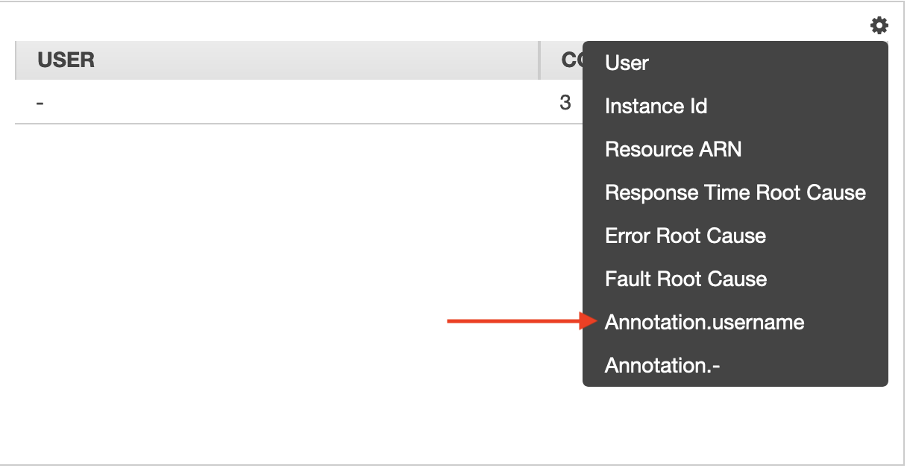

# Lab 5: Improving monitoring with x-Ray

[AWS X-Ray](https://aws.amazon.com/xray/) traces user requests as they travel through your entire application. In this Lab, we will add X-Ray to the AWS Lambda functions. We will also enable it at the Amazon API Gateway to enrich the traceability. You can find more information about the AWS X-Ray SDK for .Net and .Net Core [here](https://github.com/aws/aws-xray-sdk-dotnet).

## Step 1: Enabling AWS X-Ray for Amazon API Gateway

1. Let's once again get the restApiId for the CustomerList microservices and AspNetCoreApp. Use Amazon Api Gateway [Support Commands Page](/SupportCommands.md) to obtain the **restApiId** that contains **AspNetCoreWebApp** and **CustomerList** in the their name.

2. Execute the following commands to enable logging and tracing with the *AspNetCoreWebApp* **restApiId** pointing to the *Prod* Stage.
```
aws apigateway update-stage --rest-api-id <restApiId> --stage-name 'Prod' --patch-operations op=replace,path=/*/*/logging/dataTrace,value=true
```

4. similarly, run the following command with the *CustomerList* **restApiId** pointing to the *v1* Stage to enable logging and tracing.
```
aws apigateway update-stage --rest-api-id <restApiId> --stage-name 'v1' --patch-operations op=replace,path=/*/*/logging/dataTrace,value=true
```

## Step 2: Adding AWS X-Ray to AspNetCore WebApp

1. On the **Visual Studio Code** Go to *Window* and select the **WebApp** windows.

2. In the terminal panel, execute the command to add the AWS X-Ray library:
 ```
 dotnet add package AWSXRayRecorder.Handlers.AspNetCore --version 2.6.2
 ```
3. Instrument the X-Ray in the **Configure()** method of the **Startup.cs** file by adding the **using Microsoft.AspNetCore.Builder;** and **app.UseXRay("AspNetCoreWebApp");**. The exerpt below show where they should go in the Startup.cs file.
   
```
 using Microsoft.AspNetCore.Builder;

 public void Configure(IApplicationBuilder app, IHostingEnvironment env, ILoggerFactory loggerFactory)
 {
 ...

 app.UseAuthentication();
 app.UseXRay("AspNetCoreWebApp");
 ...
 }
```

4. Add the folling lines to **Index.cshtml.cs** and **Home.cshtml.cs**.
```
 using Amazon.XRay.Recorder.Core;
```

1. At the **Index.cshtml.cs** and **Home.cshtml.cs** insert the following line into the **public async Task OnGetAsync(int id)** method, right after *string expDateStr = expDate.ToString();*.
 ```
 AWSXRayRecorder.Instance.AddAnnotation("username", username);
 ```
6. Make sure you project still compiles correctly.
 ```
 dotnet publish -c Release
 ```
7. Re-publish the project again by executing the following command:

:notebook: **Note**: The [Support Commands Page](/SupportCommands.md) provides a list of useful commands that helps you identify the resources' names created during the labs executions; like the Amazon S3 bucked required for deployment.

 ```
 dotnet lambda deploy-serverless --template serverless.template --s3-bucket <bucket name> --s3-prefix "aspnetcorewebapp/" --stack-name <first initial> + <last initial> + -AspNetCoreWebApp
 ```

## Step 3: Visualizing the X-Ray information

1. Access the AspNetCoreWebApp app a few times.
2. Open the [AWS X-Ray](https://console.aws.amazon.com/xray/) console.
3. Select **Traces** at the left panel.
4. Take a look at the traces and their latencies. Both AspNetCoreWebApp and CustomerList have traces, because we enabled the AWS X-Ray integration at the lambda level.  
5. Select **Analytics** on the left panel.
6. Choose the cog icon to explore table configuration options. Select **Annotation.username** to filter traces.
   


7. The table now shows the analytics per user.

***You have now completed this Lab and can move onto [Lab 99](../lab-99-cleanup/).***
